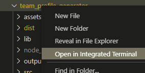
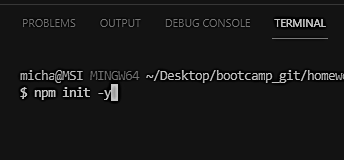
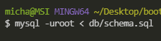
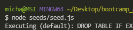
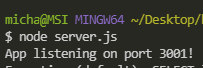
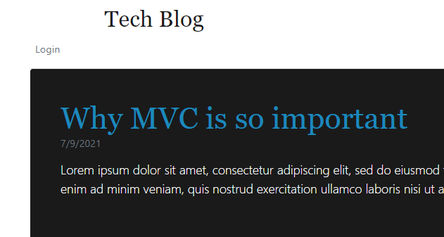
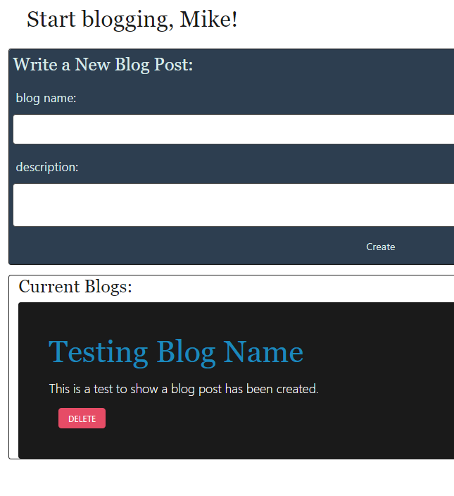
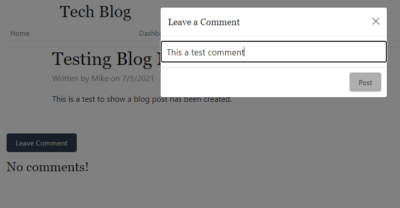

# Tech-Blog Website

## Description

This is a CMS Tech Blog website that allows for developers to create a user account and easily begin publishing blog posts on all-things-tech related. This site also allows for users to comment on other blog posts and share their thoughts. It was created using Handlebars as the templating language with Sequelize as the ORM and express-session for authentication.

## Table of Contents

* [Installation](#Install)
* [Usage](#Usage-Instructions)
* [Contribution](#Contribution-Guidelines)
* [Test](#Test-Instructions)
* [License](#License)

## Installation

Must have Node installed as well as npm dependencies including Express, Handlebars, Session, MySQL2, Sequelize, and dotenv. Must also have a graphical user interface tool such as MySQL Workbench to access and edit database.

## Usage Instructions

### Open Directory in Integrated Terminal

### run npm install. Make sure you have express, mysql2, sequelize and dotenv dependencies

### Run mysql to connect to database. Include password, if needed, with "mysql -uroot < db/schema.sql"

### Run "node seeds/seed.js" to seed database in Terminal

### Run "node server.js" or "npm start" to start server

### Once site is running, you should see the homepage and seeded blog posts with login button

### Create an account and go to your Dashboard with the link above. There youc an create a blog which will appear on your page below the form

### If you select any blog post, you'll be directed to a separate page to read. There you will be able to comment on the post

## Contribution Guidelines

Many tutor sessions, hours of reviewing assignments and help from Instructor and TAs

## Test Instructions

not applicable at this time

## License

not applicable

## Contact

* Github Username: mpagenkopf

* Email: pagenkopf.edit@gmail.com

*

